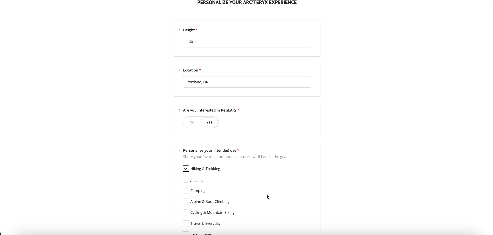
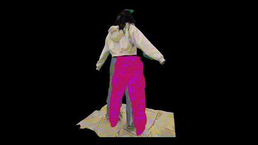

# YouCode2024

## PLUMAGE: Built for the outdoors, tailored to your adventure

PLUMAGE is a digital platform that revolutionizes the online shopping experience. With this project, we set out to solve the root causes of low self-esteem, doubt, and frustration throughout the in-person shopping process, redefining the promotion of customer mental wellness. Built with JS, computer vision, and the OpenAI API, Plumage is an Arc’teryx catalogue, personalized to you and your favorite outdoor activities.

Based on the data of Arc’teryx —the platinum sponsor of the hackathon YouCode2024—, we created a website in 24 hours in which you can access personal sizing technology, AI-powered color analysis, and 3D garment visualization for virtual try-ons, all the while connecting users to Arc’teryx community events where they can showcase their new gear.

By communicating with the OpenAI gpt-4-vision endpoint to analyze facial complexion and recommending the Arc'teryx colors that best suit you, we aim to eliminate the social anxiety associated with asking for opinions, ensuring a confident and personal shopping experience. Our 3D garment visualization helps us achieve our goal of transforming shopping from a stress-inducing chore to an act of self-care and confidence-building as well.

PLUMAGE bridges the convenience of online shopping and the personalized touch of in-store visits by building an integrated experience across all platforms. Additionally, PLUMAGE is a novel addition to the retail landscape, enhancing customer experience and peace of mind. Our innovations not only set a new standard for omnichannel experiences but also offer significant scalability across various markets and product categories.

PLUMAGE’s fit and color matching technology handle the tough parts of shopping, replacing social anxiety, self-esteem erosion, and frustration to empower YOU with the confidence to chase adventure in gear that you will feel confident in, all the while connecting you with the Arc’teryx community events and like-minded sports enthusiasts.

## Setup and Running the Code
Pre-req: Please run `npm install` from the root, backend, and frontend directories to install the dependencies.

To execute the code, please run `npm run dev:both` from the frontend directory to start both the backend and the frontend.

Keep in mind that in order to establish a successful connection with the OpenAI API, an API key is required. Since it is not allowed to post such keys, the key `OPENAI_API_KEY` from `.env` (located in the backend directory) is invalid. Please fetch your own key from [here](https://platform.openai.com/api-keys) and replace the key in `.env`.

At last, please navigate to `localhost:3000` to start exploring PLUMAGE.

